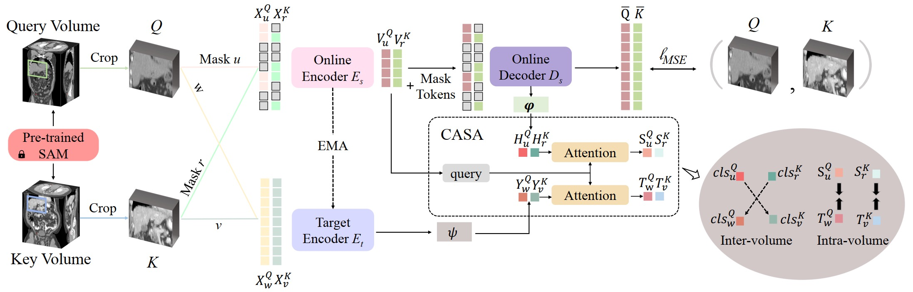
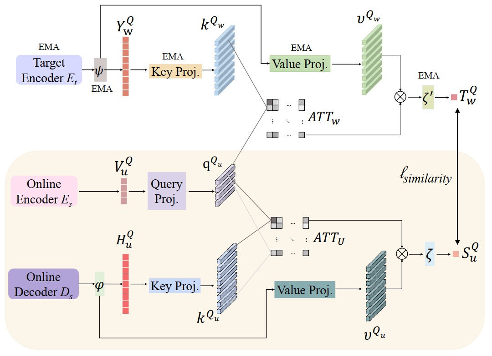
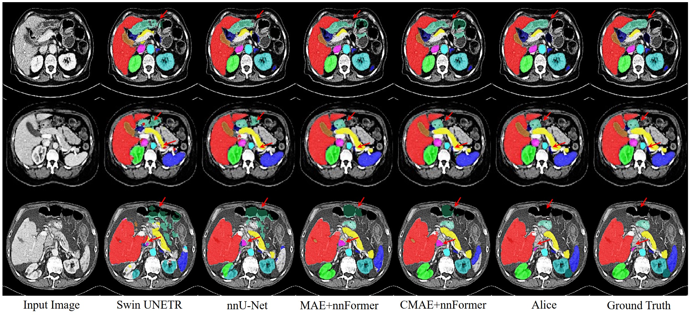

# Paper
Anatomical Invariance Modeling and Semantic Alignment for Self-supervised Learning in 3D Medical Image Analysis
[Yankai Jiang]<sup>1,3</sup>, [Mingze Sun]<sup>1,4</sup>, [Heng Cuo]<sup>1,2</sup>,  [Xiaoyu Bai]<sup>1</sup>, [Ke Yan]<sup>1,2</sup>, [Le Lu]<sup>1</sup>, [Minfeng Xu]<sup>1,2</sup> <br/>
<sup>1 </sup>DAMO Academy, Alibaba Group,   <sup>2 </sup>Hupan Lab,  <br/>
<sup>3 </sup>College of Computer Science and Technology, Zhejiang University, <br/>
<sup>4 </sup>Tsinghua Shenzhen International Graduate School, Tsinghua-Berkeley Shenzhen Institute, China <br/>
ICCV, 2023, oral <br/>

# Overview of Alice
This repository contains the code for Alice (Anatomical Invariance Modeling and Semantic Alignment for Self-supervised Learning in 3D Medical Image Analysis). The architecture of Alice is illustrated below:



In Alice, a conditional anatomical semantic alignment (CASA) module is proposed to match the most related high level semantics between the crafted contrastive views. An overview of the CASA module is presented in the following:




Qualitative visualizations of segmentation results:




# Installing Dependencies
Dependencies can be installed using:
``` bash
pip install -r requirements.txt
pip install -U openmim
mim install mmcv==1.4.7
pip install mmcv-full==1.4.7 -f https://download.openmmlab.com/mmcv/dist/cu102/torch1.9/index.html
```

# Datasets

The following datasets were used for pre-training (2,000 unlabeled CT scans). 

- Fast and Low-resource semi-supervised Abdominal oRgan sEgmentation in CT (FLARE 2022) ([Link](https://flare22.grand-challenge.org/))


Within each dataset folder, the following structure is expected:

    Dataset_FLARE2022/
    ├── imagesTr
    └── imagesTs

You should create a json containing this dataset like pretrain_all.json.
In json the data path should be '.../Dataset_FLARE2022/Case_00001_0000.nii.gz'
You can use create_json.ipynb to create the json file.

Here is an example of the dataset folder, which were used for pre-training:

    PreTrain/Dataset_FLARE2022/
    ├── dataset.json
    ├── imagesTr
    │   ├── Case_00001_0000.nii.gz
    │   ├── ...
    │   ├── ...
    └── imagesTs
        ├── ...
        ├── ...
        ├── ...

We utilize a pre-trained SAM [1] model, which performs self-supervised universal landmark detection to locate the same
body part in different volumetric medical images, then we use a default input volume crop size to generate respective views of consistent anatomies.

# Training

## Main Settings
```
--data_dir = ".../../PreTrain/Dataset_FLARE2022/"
--json_list = "pretrainset_all.json"
--output_dir = "./results/"
--embed_dir = "SAM Embedding"  ## The directory where the embeddings generated by SAM[1] are stored.
--checkpoint_file = "SAM pretrain checkpoint" ## The directory where the checkpoints of a pre-trained SAM [1] model are stored.
```

## Distributed Multi-GPU Pre-Training

The following was used to pre-train Alice on 8 X 80G A100 GPUs:

```bash
python3 -m torch.distributed.launch --nproc_per_node=8 main-DDP.py
--batch_size=8 --num_steps=100000 --lr=5e-5
```

# Citation
If you find this repository useful, please consider citing Alice paper:


# References
[1]: Yan K, Cai J, Jin D, et al. SAM: Self-supervised learning of pixel-wise anatomical embeddings in radiological images[J]. IEEE Transactions on Medical Imaging, 2022, 41(10): 2658-2669.
